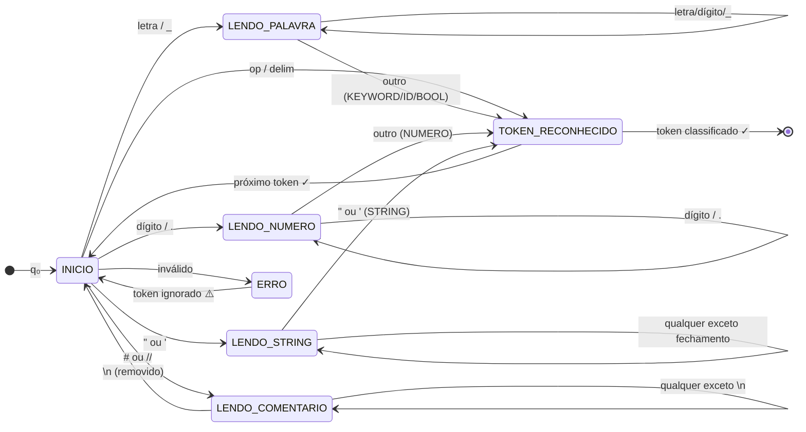

# MeowLang — Analisador Léxico Felino

<div align="center">


</div>

<div align="center">

[!)](https://git.io/typing-svg)

</div>

<br>

<div align="center">


</div>

<br>

---

## 👥 Nossa Equipe

<div align="center">

<sub>Disciplina: <b>Linguagens Formais e Autômatos</b> — Universidade São Judas Tadeu · 2026</sub>

<br><br>

<table>
  <tr>
    <td align="center" width="16%">
      <a href="https://github.com/atr3ssa">
        <br>
        <sub><b>Andressa Rabêlo</b></sub>
      </a><br>
      <sub>RA: 823213904</sub>
    </td>
    <td align="center" width="16%">
      <a href="https://github.com/Julia-Olive">
        <br>
        <sub><b>Júlia Oliveira</b></sub>
      </a><br>
      <sub>RA: 823214680</sub>
    </td>
    <td align="center" width="16%">
      <a href="https://github.com/Marzocca99">
        <br>
        <sub><b>Lucas Marzocca</b></sub>
      </a><br>
      <sub>RA: 823116813</sub>
    </td>
    <td align="center" width="16%">
      <a href="https://github.com/Elmarquitoos">
        <br>
        <sub><b>Marcos V. Santos</b></sub>
      </a><br>
      <sub>RA: 82327399</sub>
    </td>
    <td align="center" width="16%">
      <a href="https://github.com/matheushfg">
        <br>
        <sub><b>Matheus H. F.</b></sub>
      </a><br>
      <sub>RA: 823141914</sub>
    </td>
    <td align="center" width="16%">
      <a href="https://github.com/b3ery">
        <br>
        <sub><b>Mylena Soares</b></sub>
      </a><br>
      <sub>RA: 824144075</sub>
    </td>
  </tr>
</table>

</div>

<br>

---

## 🌙 Sobre o Projeto

> **MeowLang** é uma linguagem de programação esotérica com tema felino, desenvolvida como trabalho prático da disciplina de **Linguagens Formais e Autômatos**. O projeto implementa um **analisador léxico completo** — com tokenização, tabela de símbolos, eliminação de comentários, detecção de erros léxicos e sintáticos, interpretação de comandos e log de compilação animado de 8 segundos. Tudo em HTML + CSS + JavaScript puro, sem dependências. 🐱

<br>

<div align="center">

```
╔══════════════════════════════════════════════════════════════════╗
║  📝 Código Fonte  →  🔍 Tokenização  →  🏷️ Tokens Classificados ║
║        ↓                                          ↓              ║
║  📋 Tabela de Símbolos  ←  🧶 Variáveis/Funções/Classes         ║
║        ↓                                                         ║
║  🐱 Console  →  ▶ Saída Final  →  😻 Ronronando... concluído!   ║
╚══════════════════════════════════════════════════════════════════╝
```

</div>

<br>

---

## 🧠 Fundamentação Teórica — Analisador Léxico

O analisador léxico é modelado formalmente seguindo os conceitos de linguagens formais:

$$M = (Q,\ \Sigma,\ \delta,\ q_0,\ F)$$

| Componente | Símbolo | Implementação no MeowLang |
|:---:|:---:|:---|
| **Estados** | $Q$ | `INICIO`, `LENDO_PALAVRA`, `LENDO_NUMERO`, `LENDO_STRING`, `LENDO_COMENTARIO`, `TOKEN_RECONHECIDO`, `ERRO` |
| **Alfabeto** | $\Sigma$ | Letras, dígitos, operadores, delimitadores, aspas, `#`, `/` |
| **Transição** | $\delta$ | `δ(INICIO, letra) → LENDO_PALAVRA` · `δ(INICIO, dígito) → LENDO_NUMERO` |
| **Estado Inicial** | $q_0$ | `INICIO` — aguardando primeiro caractere |
| **Estados Finais** | $F$ | `TOKEN_RECONHECIDO` — token completo identificado |

<br>

### Tabela de Transições δ — Tokenizer

<div align="center">

| Estado Atual | Entrada | Próximo Estado | Token Gerado |
|:---:|:---:|:---:|:---:|
| `INICIO` | letra ou `_` | `LENDO_PALAVRA` | — |
| `INICIO` | dígito ou `.` | `LENDO_NUMERO` | — |
| `INICIO` | `"` ou `'` | `LENDO_STRING` | — |
| `INICIO` | `#` ou `//` | `LENDO_COMENTARIO` | — |
| `INICIO` | operador | `TOKEN_RECONHECIDO` | `OPERADOR` |
| `INICIO` | delimitador | `TOKEN_RECONHECIDO` | `DELIMITADOR` |
| `LENDO_PALAVRA` | letra/dígito/`_` | `LENDO_PALAVRA` | — |
| `LENDO_PALAVRA` | outro | `TOKEN_RECONHECIDO` | `KEYWORD` / `IDENTIFICADOR` / `BOOLEAN` |
| `LENDO_NUMERO` | dígito ou `.` | `LENDO_NUMERO` | — |
| `LENDO_NUMERO` | outro | `TOKEN_RECONHECIDO` | `NUMERO` |
| `LENDO_STRING` | qualquer exceto `"` | `LENDO_STRING` | — |
| `LENDO_STRING` | `"` ou `'` | `TOKEN_RECONHECIDO` | `STRING` |
| `LENDO_COMENTARIO` | qualquer exceto `\n` | `LENDO_COMENTARIO` | — |
| `LENDO_COMENTARIO` | `\n` | `INICIO` | removido |
| `INICIO` | caractere inválido | `ERRO` | `ERRO` |

</div>

<br>

### 📊 Diagrama de Estados — Tokenizer



<br>

---

## 🐱 Gramática MeowLang

### Tipos de Variáveis

<div align="center">

| Palavra-chave | Equivalente | Descrição | Validação |
|:---:|:---:|:---|:---:|
| `psiu` | `var` | Variável genérica | qualquer valor |
| `psiu_int` | `int` | Número inteiro | rejeita decimais e strings |
| `psiu_float` | `float` | Número decimal | rejeita strings |
| `psiu_string` | `string` | Texto | converte qualquer valor |
| `psiu_bool` | `bool` | Booleano | só `ronrom` ou `bufar` |
| `psiu_lista` | `array` | Lista | inicializa vazia |
| `ronrom` | `true` | Verdadeiro | — |
| `bufar` | `false` | Falso | — |
| `dormindo` | `null` | Nulo | — |

</div>

### Comandos

<div align="center">

| Palavra-chave | Equivalente | Descrição |
|:---:|:---:|:---|
| `miar` | `print` | Imprime valor no console |
| `se_miar` | `if` | Condicional |
| `hiss` | `else` | Bloco alternativo |
| `cacar` | `while` | Laço com condição |
| `cada_pelo` | `for` | Laço com init; cond; incr |
| `arranhar` | `return` | Retorna valor da função |
| `ronronar` | `function` | Declara função com parâmetros |
| `gatil` | `class` | Declara classe com atributos e métodos |

</div>

### Comentários

```
# comentário de linha
// também funciona
/* comentário
   de bloco */
```

<br>

---

## 📝 Exemplos de Código

### Variáveis e Print
```
psiu_string nome  = "Whiskers"
psiu_int    vidas = 9
psiu_bool   ativo = ronrom

miar("Nome: "  + nome)
miar("Vidas: " + vidas)
```

### Condicional
```
se_miar (vidas > 0) {
  miar("😸 O gato está vivo!")
} hiss {
  miar("😿 Sem vidas...")
}
```

### Loop While
```
psiu_int i = 0
cacar (i < 3) {
  miar("Vida " + i)
  psiu_int i = i + 1
}
```

### Loop For
```
cada_pelo (psiu_int n = 1; n < 6; psiu_int n = n + 1) {
  psiu_int r = n * 3
  miar(n + " x 3 = " + r)
}
```

### Função
```
ronronar calcular(a, b) {
  psiu_int resultado = a + b
  miar("Resultado: " + resultado)
  arranhar resultado
}

calcular(5, 3)
```

### Classe
```
gatil Gato {
  psiu_string nome  = "Garfield"
  psiu_int    vidas = 9

  ronronar apresentar(apelido) {
    miar("Eu sou " + apelido + "!")
  }
}
```

<br>

---

## ⚙️ Funcionalidades do Analisador

<div align="center">

| Funcionalidade | Status | Descrição |
|:---:|:---:|:---|
| 🏷️ **Tokenização completa** | ✅ | KEYWORD, ID, STRING, NUMERO, OP, DELIM, BOOL, CMT |
| ✂️ **Eliminação de espaços** | ✅ | Espaços, tabs e quebras de linha removidos |
| 💬 **Eliminação de comentários** | ✅ | Suporte a `#`, `//` e `/* */` |
| ⚠️ **Erro léxico com linha** | ✅ | Token inválido exibe linha exata |
| 🔴 **Erro sintático** | ✅ | Chaves, parênteses e strings não fechados |
| 😿 **Tela de erro animada** | ✅ | "Errou e Molhou o Gato 😿💦🔫" |
| 🧶 **Tabela de Símbolos — Variáveis** | ✅ | Nome, tipo, valor |
| 🐾 **Tabela de Símbolos — Funções** | ✅ | Nome, parâmetros, corpo |
| 🏠 **Tabela de Símbolos — Classes** | ✅ | Nome, atributos, métodos |
| 🔢 **Verificação de tipo** | ✅ | Erro em tempo de execução para tipos incompatíveis |
| 📢 **Interpretação miar** | ✅ | Print com concatenação e variáveis |
| 😸 **Interpretação se_miar/hiss** | ✅ | Condicional com escopo compartilhado |
| 😹 **Interpretação cacar** | ✅ | While com avaliação dinâmica da condição |
| 🐱 **Interpretação cada_pelo** | ✅ | For com init; cond; incr separados por `;` |
| 🐾 **Interpretação ronronar** | ✅ | Função com parâmetros, chamada e retorno |
| 🏠 **Interpretação gatil** | ✅ | Classe com atributos e métodos registrados |
| 😻 **Log de compilação** | ✅ | 15 etapas animadas em 8 segundos |

</div>

<br>

---

## 🚀 Como Executar

**💻 Local:**
```bash
git clone [https://github.com/b3ery/MeowLang.git]
cd meowlang

# Abra o arquivo no navegador
open index.html
# ou arraste o arquivo para o navegador
```

> Sem dependências externas. HTML5 + CSS3 + JavaScript puro. ✨

<br>

---

## 📁 Estrutura do Projeto

```
meowlang/
├── index.html                    # Implementação completa
├── pesquisa_analisador_lexico.pdf   # Pesquisa teórica (item 1)
└── README.md                        # Este arquivo
```

<br>

---

<div align="center">

Feito com 🐾 muito <code>miar()</code> e <code>ronronar()</code>

<br>


</div>
